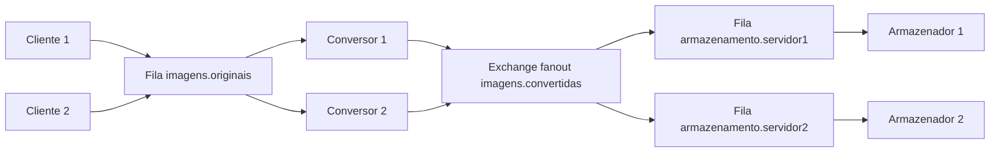
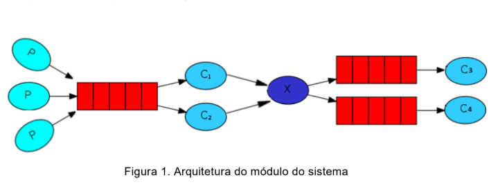

<div align="center">
  
  <h1>Sistemas Distribuídos</h1>
  <p>Atividade 1 · Unidade 1 · Comunicação por mensagens com RabbitMQ</p>
  <p><strong>Aluno:</strong> Breno Thiago Argemiro Santos</p>
  <p>Clientes enviam. Conversores processam. Todos os armazenadores recebem uma cópia.</p>
  <p>
    
    
    
    
  </p>
</div>

## Sobre o projeto

Aplicação em **Java 21** que converte imagens PNG/JPEG para tons de cinza usando comunicação por mensagens. Vários clientes publicam imagens em uma fila compartilhada; vários conversores dividem as tarefas; cada imagem convertida é enviada a **todos os servidores de armazenamento**.

A demonstração usa **2 clientes, 2 conversores e 2 armazenadores**, executados em containers separados. Preserva nome, formato, dimensões e transparência de PNG. O Maven compila a aplicação dentro do Docker.

**[Arquitetura](#arquitetura) · [RabbitMQ](#comunicação-com-rabbitmq) · [Executar](#executar-em-poucos-comandos) · [Testar](#como-testar) · [Código](#entendendo-o-código)**

## Exemplo de conversão

A logo da UFS passa pela fila de trabalho, é convertida por um consumidor e distribuída pelo exchange fanout aos dois armazenadores.

<table>
  <tr><th>Entrada colorida</th><th>Resultado em tons de cinza</th></tr>
  <tr>
    <td></td>
    <td></td>
  </tr>
</table>

## Arquitetura



1. **Cliente:** publica os bytes da imagem e seus metadados na fila `imagens.originais`.
2. **Conversor:** recebe uma tarefa da fila compartilhada, converte a imagem e publica no exchange `imagens.convertidas`.
3. **Exchange fanout:** encaminha uma cópia da publicação para cada fila de armazenamento vinculada.
4. **Armazenador:** consome sua fila exclusiva e salva em `servidor/cliente/nome-original`.

**Os conversores dividem tarefas; os armazenadores recebem cópias.** Uma fila única para os armazenadores dividiria as imagens entre servidores e não atenderia à redundância exigida.

<details>
<summary>Figura de referência do enunciado</summary>



O X corresponde ao exchange. Ele é uma estrutura do RabbitMQ, sem necessidade de um programa ou container próprio.

</details>

## Comunicação com RabbitMQ

O objetivo central da atividade é combinar dois padrões de comunicação: **fila de trabalho**, para distribuir o processamento, e **publicação/assinatura**, para replicar os resultados. As imagens são a carga transportada pelas mensagens.

### Produtores e mensagens

Cada cliente atua como produtor e publica na fila `imagens.originais` por meio do exchange padrão do RabbitMQ, usando o nome da fila como chave de roteamento. O corpo contém os bytes da imagem; os metadados identificam cliente, nome original, formato e UUID da mensagem.

Enviar o conteúdo permite que os processos estejam em máquinas diferentes. A comunicação é assíncrona: o cliente aguarda a confirmação da publicação pelo broker e encerra, sem precisar aguardar conversão e armazenamento.

### Fila de trabalho: consumidores concorrentes

Os conversores consomem a **mesma fila** `imagens.originais`. Em operação normal, uma entrega vai a um dos consumidores, dividindo o trabalho entre as instâncias. Eles não precisam coordenar tarefas diretamente entre si: o RabbitMQ faz a distribuição.

```java
consumer.basicQos(1);
consumer.basicConsume(queue, false, deliverCallback, cancelCallback);
```

Nesse exemplo, `deliverCallback` representa a função que processa a entrega, e `cancelCallback` trata o cancelamento do consumo. `basicQos(1)` limita cada instância a uma mensagem sem confirmação por vez. O `false` desabilita o ACK automático. Assim, um conversor ocupado não acumula várias tarefas enquanto outro pode processá-las. A quantidade de tarefas por instância não precisa ser exatamente igual.

### Publicação/assinatura: exchange fanout

Após converter, o consumidor também atua como produtor: publica no exchange `imagens.convertidas`. Esse exchange é do tipo **fanout**, que encaminha cada publicação para todas as filas vinculadas, sem selecionar destinos pela chave de roteamento.

A topologia declara uma fila durável por servidor e cria os vínculos:

```java
channel.exchangeDeclare(OUTPUT, BuiltinExchangeType.FANOUT, true);
channel.queueDeclare(queue, true, false, false, arguments);
channel.queueBind(queue, OUTPUT, "");
```

`queueBind` liga a fila ao exchange. Por isso, cada armazenador recebe sua cópia completa. Se todos consumissem uma única fila, dividiriam os arquivos entre si e não haveria a redundância solicitada.

### Confirmação da publicação e confirmação do consumo

São duas confirmações distintas:

- **Publisher confirm:** o broker confirma uma publicação. O código habilita `confirmSelect()` e aguarda `waitForConfirmsOrDie(10000)`. A publicação usa `mandatory=true` para detectar ausência de fila de destino.
- **Consumer ACK:** o consumidor informa que concluiu uma entrega. O código chama `basicAck` somente depois de terminar a etapa.

No conversor, a ordem é **receber → converter → publicar → aguardar confirmação → ACK da entrada**. No armazenador, é **receber → gravar → ACK**. Confirmar a entrada antes de concluir a etapa poderia permitir que o broker removesse uma mensagem ainda não processada.

Se um processo cair antes do ACK, a entrega volta à fila e pode ser recebida novamente. O projeto admite esse processamento repetido; o mesmo caminho de saída evita gerar arquivos extras. A confirmação do broker não significa que todos os armazenadores já salvaram: cada um conclui e confirma sua própria entrega.

### Persistência, inicialização e erros

As filas e o exchange são duráveis; as mensagens usam `deliveryMode=2`; o volume `rabbit-data` conserva os dados do broker entre reinícios normais. O inicializador `topologia` cria **todas as filas de armazenamento e seus vínculos antes dos envios**.

Isso importa porque fanout encaminha publicações às filas existentes naquele momento. Um servidor desligado, mas com fila já criada, acumula pendências. Um servidor adicionado depois não recebe automaticamente publicações anteriores ao vínculo de sua fila.

Erros transitórios usam `basicNack(..., true)` para devolver a entrega à fila. Imagens corrompidas ou metadados inválidos usam `basicReject(..., false)`; a configuração dead-letter encaminha essas mensagens à fila `imagens.erros`, e o motivo aparece nos logs.

### Limites das garantias

O projeto não oferece processamento exatamente uma vez e usa um único broker, sem cluster RabbitMQ. A redundância é do armazenamento das imagens; não cobre perda física do disco do broker. O encaminhamento dead-letter em filas clássicas tem garantias diferentes das publicações explícitas com confirmação.

## Executar em poucos comandos

### Requisitos

- Docker Engine ou Docker Desktop, com **Docker Compose v2**.
- Acesso à internet no primeiro build, para baixar imagens e dependências.
- Portas locais **5672** e **15672** disponíveis.
- Para os testes de falha: **Bash**, `awk` e `timeout` (Linux ou WSL).

Não é necessário instalar Java ou Maven na máquina para executar pelo Docker.

```bash
git clone https://github.com/Breno-Thiago/sistemas-distribuidos-atividade-1-unidade-1.git
cd sistemas-distribuidos-atividade-1-unidade-1

# Linux/WSL: os arquivos de saída ficam com o seu usuário.
export LOCAL_UID=$(id -u)
export LOCAL_GID=$(id -g)

# Compilar e iniciar RabbitMQ + dois conversores + dois armazenadores.
docker compose up -d --build --scale conversor=2

# Publicar as imagens de cada cliente.
docker compose run --rm cliente1
docker compose run --rm cliente2

# Aguardar os resultados e conferir os dois servidores.
docker compose run --rm verificador
```

Resultado esperado:

```text
VERIFICAÇÃO OK: 10 imagens em 2 servidores; nomes, dimensões, cinza, transparência e conteúdo conferidos
```

Os **20 arquivos convertidos** aparecem nas pastas locais:

```text
armazenamento/
├── servidor1/
│   ├── cliente1/   # As 5 imagens do cliente 1
│   └── cliente2/   # As 5 imagens do cliente 2
└── servidor2/
    ├── cliente1/   # As mesmas 5 imagens do cliente 1
    └── cliente2/   # As mesmas 5 imagens do cliente 2
```

As saídas de execução são ignoradas pelo Git. Um clone novo as gera ao enviar as imagens.

### Painel e logs

Abra **http://localhost:15672**. Usuário: `atividade`; senha: `atividade-local`. São credenciais de demonstração, com portas expostas somente em localhost.

```bash
# Ver os containers.
docker compose ps

# Acompanhar recebimento, conversão e gravação.
docker compose logs -f conversor armazenamento1 armazenamento2

# Inspecionar filas e consumidores.
docker compose exec rabbitmq rabbitmqctl list_queues \
  name messages_ready messages_unacknowledged consumers
```

`Ctrl+C` encerra o acompanhamento dos logs. O serviço `topologia` terminar com código 0 é esperado: ele cria a configuração e encerra.

### Testar suas próprias imagens

Coloque arquivos `.png`, `.jpg` ou `.jpeg` em `clientes/cliente1` ou `clientes/cliente2` e execute novamente o cliente correspondente. O cliente lê os arquivos da pasta imediata e encerra após publicar; não monitora a pasta continuamente.

O nome original é preservado. Os clientes podem enviar arquivos diferentes com o mesmo nome porque cada um possui sua subpasta de saída. Reenviar o mesmo nome pelo mesmo cliente substitui o resultado anterior; não há controle de versões para envios concorrentes desse mesmo nome.

### Encerrar

```bash
docker compose down
```

Preserva as imagens nas pastas locais e o volume de dados do RabbitMQ.


## Como testar

O [roteiro completo de testes](docs/ROTEIRO_TESTES.md) apresenta duas formas de testar: execução automática de todos os cenários e demonstração manual, com comandos, observações e resultados esperados em cada etapa.

O fluxo é **iniciar → publicar → observar a fila → processar → verificar as réplicas → desligar e recuperar um armazenador → interromper e recuperar conversores → isolar mensagem inválida → verificar falha e concluir**.

Para executar tudo na configuração padrão:

```bash
bash scripts/test-integration.sh
```

Para a apresentação, siga os passos numerados do roteiro e acompanhe `messages_ready`, `messages_unacknowledged` e `consumers` no RabbitMQ. A consulta às filas e a conferência dos arquivos são evidências complementares.

### Verificação das imagens

```bash
docker compose run --rm verificador
```

O verificador Java aguarda até **60 segundos** e confere:

- Presença das imagens em todos os armazenadores configurados.
- Nome original, subpasta do cliente e dimensões.
- Pixels em cinza e preservação do alfa de PNG.
- Correspondência com a conversão da entrada atual.
- Igualdade binária das réplicas.

Retorna **0** em sucesso e código diferente de zero em falha. Entradas corrompidas são informadas e ignoradas nessa comparação; o teste de integração confere seu encaminhamento à fila de erros.

### Teste completo com falhas reais

```bash
bash scripts/test-integration.sh
```

A aplicação e o verificador são Java; **Bash apenas coordena os comandos Docker**. O script usa RabbitMQ real e executa:

| Cenário | O que comprova |
| --- | --- |
| Envio dos dois clientes | Conversão, réplicas, transparência e nomes iguais entre clientes. |
| Armazenador 2 desligado | O servidor 1 continua salvando e a fila do servidor 2 retém as imagens. |
| Retomada do armazenador | As imagens pendentes são gravadas. |
| SIGKILL dos conversores antes do ACK | A mensagem é reentregue; os logs precisam mostrar `reentrega=true`. |
| Imagem corrompida | Vai para `imagens.erros` sem bloquear imagens válidas. |
| Saída inexistente | O verificador retorna falha. |

Resultado esperado:

```text
========== RELATÓRIO FINAL DOS TESTES ==========
[OK] RabbitMQ e topologia prontos, com todos os consumidores conectados
[OK] Dois clientes publicaram; conversores consumiram a fila de trabalho
[OK] Fanout: imagens válidas verificadas nos dois armazenadores
[OK] Nomes, dimensões, tons de cinza, transparência e réplicas conferidos
[OK] Armazenador desligado: fila reteve mensagens e entregou após a retomada
[OK] SIGKILL dos conversores: reentrega comprovada nos logs
[OK] Imagem corrompida isolada na fila de erros, sem bloquear imagens válidas
[OK] Verificador rejeitou uma saída inexistente, como esperado
[OK] Ambiente restaurado e arquivos temporários removidos

Resultados após a limpeza:
VERIFICAÇÃO OK: 10 imagens em 2 servidores; nomes, dimensões, cinza, transparência e conteúdo conferidos
TODOS OS TESTES PASSARAM
```

O relatório também informa a duração, o código de saída e o estado dos serviços e das filas. A quantidade de imagens é obtida pelo verificador após a limpeza; pode mudar se você adicionar entradas. Em caso de falha, o resumo mostra a etapa interrompida e quais cenários já foram comprovados.

Execute em um momento sem outros envios: o script interrompe e recria serviços **deste projeto**. Usa nomes temporários exclusivos, remove somente seus arquivos de teste e restaura dois conversores e dois armazenadores. As mensagens inválidas ficam na fila de erros para inspeção. O arquivo [TESTES.md](TESTES.md) registra a validação executada.

## Entendendo o código

```text
.
├── src/main/java/br/ufs/imagens/
│   ├── Main.java                  # Conexão, filas e papéis da aplicação
│   ├── Images.java                # Conversão e gravação de imagens
│   └── Verifier.java              # Amostras e conferência dos resultados
├── clientes/cliente1/             # Originais do primeiro produtor
├── clientes/cliente2/             # Originais do segundo produtor
├── armazenamento/servidor1/       # Saídas locais, geradas na execução
├── armazenamento/servidor2/       # Réplicas locais, geradas na execução
├── scripts/test-integration.sh    # Testes de integração em Bash
├── docs/imagens/                  # Exemplo convertido da logo UFS
├── Dockerfile                    # Compilação e execução em dois estágios
├── compose.yaml                  # Serviços, rede, volumes e dependências
├── pom.xml                       # Dependências Maven e JAR executável
└── TESTES.md                      # Evidências da validação
```

### `Main.java`: comunicação e execução

O mesmo JAR roda em processos independentes, escolhendo o papel pelo primeiro argumento:

| Comando | Função |
| --- | --- |
| `topologia` | Declara filas, exchange e vínculos antes dos clientes. |
| `cliente ID PASTA` | Lê PNG/JPEG, publica e encerra. |
| `conversor` | Aguarda mensagens, converte e republica. |
| `armazenador ID PASTA` | Consome sua fila e grava as imagens. |
| `amostras PASTA` | Gera somente os padrões artificiais ausentes. |
| `verificar CLIENTES ARMAZENAMENTO SEGUNDOS` | Confere as saídas dentro do prazo informado. |

A mensagem carrega os **bytes da imagem**, um UUID e metadados `cliente`, `nome` e `formato`. Não carrega apenas um caminho local: o destinatário pode estar em outra máquina.

`connect()` configura a conexão; `topology()` declara as estruturas; `client()` envia arquivos; `publish()` aguarda confirmações; `consume()` trata cada entrega e envia o ACK depois de concluir a etapa.

### `Images.java`: transformação e gravação

`ImageIO` decodifica e codifica as imagens. `grayscale()` percorre os pixels e calcula uma intensidade:

```text
cinza = 0,299 × vermelho + 0,587 × verde + 0,114 × azul
```

Imagens opacas usam um canal de cinza. PNG com transparência conserva o canal alfa e recebe componentes de cor iguais. `save()` valida os nomes, escreve um temporário, força a escrita e move o arquivo para o destino final.

### `Verifier.java`: conferência

`samples()` gera os padrões artificiais. `verify()` lê as entradas válidas, calcula a conversão esperada e compara os arquivos de cada servidor. Também verifica pixels, dimensões e transparência. Os arquivos de entrada já estão incluídos no repositório.

## Docker e configuração

O **Dockerfile** compila com Maven/Java 21 em um estágio e copia o JAR para outro estágio com o ambiente de execução Java. A opção `java.awt.headless=true` permite processar imagens sem interface gráfica.

O **Compose** cria os serviços, uma rede e os volumes. `rabbitmq` é o nome de rede usado pelos programas para conectar ao broker. O healthcheck aguarda o broker responder; `topologia` cria as estruturas e encerra; os demais processos iniciam após seu sucesso.

| Configuração | Finalidade |
| --- | --- |
| `RABBIT_HOST`, `RABBIT_USER`, `RABBIT_PASSWORD` | Conexão dos programas com o broker. |
| `STORAGE_IDS` | IDs dos servidores cujas filas precisam ser criadas. |
| `LOCAL_UID`, `LOCAL_GID` | Proprietário dos arquivos gerados no Linux/WSL. |
| `CONVERSION_DELAY_MS` | Atraso artificial usado no teste de interrupção; padrão 0. |
| `./clientes/cliente1:/entrada:ro` | Disponibiliza as originais em modo somente leitura. |
| `./armazenamento/servidor1:/saida` | Salva resultados diretamente na pasta local. |
| `rabbit-data:/var/lib/rabbitmq` | Persiste os dados do broker. |

Os blocos `&app`/`*app` reutilizam configurações. O profile `ferramentas` impede que clientes e verificadores sejam executados automaticamente em cada inicialização.

## Adicionar instâncias

### Conversores

Compartilham a fila de originais. Não há `container_name` fixo, permitindo aumentar a escala:

```bash
docker compose up -d --scale conversor=4
```

### Clientes

```bash
mkdir -p clientes/cliente3
# Coloque suas imagens na pasta e execute:
docker compose run --rm -v "$PWD/clientes/cliente3:/entrada:ro" \
  cliente1 cliente cliente3 /entrada
```

### Armazenadores

Adicione `servidor3` a `STORAGE_IDS` no bloco compartilhado `x-app.environment`, crie `armazenamento/servidor3` e acrescente um serviço em `services`:

```yaml
  armazenamento3:
    <<: *app
    command: ["armazenador", "servidor3", "/saida"]
    volumes: ["./armazenamento/servidor3:/saida"]
    restart: unless-stopped
```

Pause os conversores durante a criação dos novos vínculos e não faça envios nessa mudança:

```bash
docker compose stop conversor
docker compose up --force-recreate topologia
docker compose up -d --scale conversor=2
```

O novo servidor recebe publicações depois que sua fila é vinculada; não recupera automaticamente o histórico. O verificador passa a conferir o novo ID. O teste de integração Bash é voltado à demonstração padrão com dois armazenadores.

## Dados de teste

As pastas `clientes/cliente1` e `clientes/cliente2` incluem dez imagens PNG/JPEG para testar o fluxo. A conversão preserva nome, dimensões e transparência; o tamanho comprimido pode aumentar ou diminuir.

## Referências

- [RabbitMQ — Work Queues em Java](https://www.rabbitmq.com/tutorials/tutorial-two-java)
- [RabbitMQ — Publish/Subscribe em Java](https://www.rabbitmq.com/tutorials/tutorial-three-java)
- [RabbitMQ — Confirmações](https://www.rabbitmq.com/docs/confirms)
- [Java 21 — ImageIO](https://docs.oracle.com/en/java/javase/21/docs/api/java.desktop/javax/imageio/ImageIO.html)
- [Java 21 — BufferedImage](https://docs.oracle.com/en/java/javase/21/docs/api/java.desktop/java/awt/image/BufferedImage.html)

Créditos dos exemplos: marca [UFS](https://ascom.ufs.br/pagina/3217-brasao-e-marcas-da-ufs); sala de aula de [Thedofc](https://commons.wikimedia.org/wiki/File:SWW-classroom1.jpg), domínio público; biblioteca de [Raysonho](https://commons.wikimedia.org/wiki/File:LibraryReadingRoom4.jpg), CC0.
