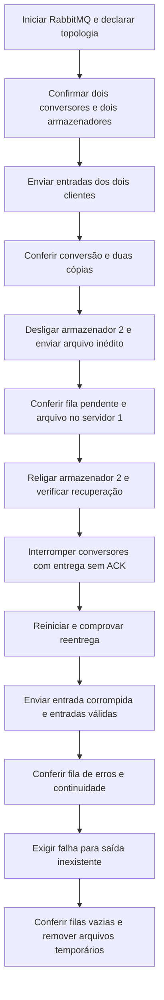

# Roteiro completo de testes — RabbitMQ

Este roteiro acompanha a mensagem desde a publicação até o armazenamento e mostra como observar distribuição, replicação e recuperação após falhas.

Use a configuração padrão: **dois conversores e dois armazenadores**. Execute os blocos do roteiro manual no mesmo terminal Bash, na raiz do projeto. Um segundo terminal pode acompanhar os logs. Durante os cenários de falha, não faça outros envios.

## Opção 1 — Executar tudo automaticamente

Requisitos: Docker Compose v2, Bash, `awk` e `timeout`, em Linux ou WSL. Java e Maven são usados dentro do Docker.

```bash
bash scripts/test-integration.sh
```

O script constrói a aplicação, inicia o broker e as instâncias, executa os cenários abaixo e restaura os servidores. Cada condição tem prazo máximo de espera; uma condição não satisfeita produz código diferente de zero.



### Evidências esperadas

| Etapa | Resultado exigido | Conceito do RabbitMQ |
| --- | --- | --- |
| Inicialização | 2 consumidores na fila de originais e 1 em cada fila de armazenamento. | Topologia e consumidores independentes. |
| Envio | Publicações confirmadas e arquivos verificados nos dois servidores. | Produtores e publisher confirms. |
| Processamento | Conversores disponíveis consomem a mesma fila. | Work queue e `prefetch=1`. |
| Replicação | Todas as entradas válidas aparecem nos dois armazenadores. | Exchange fanout e uma fila por destino. |
| Armazenador desligado | O servidor 1 salva; a fila do servidor 2 acumula mensagens. | Desacoplamento entre publicação e consumo. |
| Retomada | O servidor 2 salva o arquivo que recebeu enquanto estava desligado. | Fila durável com pendências. |
| Interrupção | Arquivo inédito chega aos dois servidores; log contém `reentrega=true`. | Entrega sem ACK volta à fila. |
| Entrada inválida | Fila de erros aumenta; arquivos válidos continuam sendo processados. | Rejeição e dead-letter. |
| Verificação negativa | Saída inexistente é recusada pelo verificador. | Detecção de falhas no teste. |
| Conclusão | Filas de trabalho com `ready=0` e `unacknowledged=0`. | Todas as etapas terminaram e confirmaram suas entregas. |

O sucesso aparece como `TODOS OS TESTES PASSARAM`, com código de saída **0**. A mensagem `VERIFICAÇÃO FALHOU` do teste de saída inexistente é esperada: nesse cenário, a falha é justamente a condição exigida.

Ao terminar, um **relatório final** reúne os cenários comprovados, a verificação das entradas que permanecem após a limpeza, o estado das filas e dos consumidores, a duração e o código de saída. Ele aparece depois de restaurar o ambiente. A saída da verificação negativa esperada é ocultada para evitar confundi-la com uma falha real da execução.

Se algum passo falhar, o relatório indica a etapa interrompida, lista somente os cenários já comprovados e sugere o comando para consultar os logs. A execução retorna código diferente de zero.

Para guardar a saída e conferir o código:

```bash
set -o pipefail
bash scripts/test-integration.sh 2>&1 | tee /tmp/ufs-rabbitmq-testes.log
resultado=${PIPESTATUS[0]}
printf 'Código do teste: %s\n' "$resultado"
```

O script cria nomes exclusivos, remove somente seus arquivos de teste e deixa os serviços rodando. As mensagens corrompidas ficam na fila de erros para inspeção. As contagens durante os cenários incluem arquivos temporários e podem ser maiores que as dez entradas originais.

## Opção 2 — Demonstrar o fluxo manualmente

### 1. Iniciar as instâncias

```bash
export LOCAL_UID=$(id -u)
export LOCAL_GID=$(id -g)
export CONVERSION_DELAY_MS=0
docker compose up -d --build --scale conversor=2
docker compose ps
docker compose exec -T rabbitmq rabbitmqctl list_queues -q \
  name messages_ready messages_unacknowledged consumers
```

**Observe:** RabbitMQ saudável, dois containers de conversão e dois de armazenamento. Após todos se conectarem, a fila `imagens.originais` deve ter **2 consumidores**; cada fila `armazenamento.servidorN`, **1**. O inicializador `topologia` encerra com sucesso após criar as estruturas.

Se algum consumidor ainda não aparecer, aguarde alguns segundos e repita a consulta. Sem consumidores conectados, não avance para os cenários seguintes.

### 2. Abrir o acompanhamento

No segundo terminal, na raiz do projeto:

```bash
docker compose logs -f conversor armazenamento1 armazenamento2
```

Você verá `RECEBIDA`, `CONVERTIDA` e `SALVA`. O identificador no início do log indica a instância que executou a etapa. `Ctrl+C` sai dos logs sem parar os serviços.

No painel **http://localhost:15672**, entre com `atividade` / `atividade-local` e abra **Queues and Streams**. Compare as filas de originais, armazenamento e erros.

### 3. Demonstrar que a fila guarda tarefas

Pare os conversores antes de publicar:

```bash
docker compose stop conversor
docker compose run --rm --no-deps cliente1
docker compose run --rm --no-deps cliente2
docker compose exec -T rabbitmq rabbitmqctl list_queues -q \
  name messages_ready messages_unacknowledged consumers
```

**Observe:** a fila `imagens.originais` tem **0 consumidores** e acumula mensagens em `messages_ready`. Com somente as dez entradas incluídas no projeto e uma fila inicialmente vazia, serão dez mensagens prontas. O cliente consegue publicar sem haver conversor ativo.

Os arquivos de saída de uma execução anterior podem continuar nas pastas. Nesta etapa, a evidência é a mensagem pendente no broker; a existência de um arquivo antigo não prova um novo processamento.

### 4. Consumir as tarefas e verificar a replicação

```bash
docker compose start conversor
docker compose run --rm --no-deps verificador
docker compose exec -T rabbitmq rabbitmqctl list_queues -q \
  name messages_ready messages_unacknowledged consumers
```

**Observe:** os logs identificam o conversor que recebeu cada entrega. A distribuição não precisa ser exatamente metade para cada instância. Depois do processamento, originais e filas de armazenamento ficam com `messages_ready=0` e `messages_unacknowledged=0`.

Se ainda houver pendências, aguarde e repita a consulta antes de avançar. O verificador confere os arquivos, enquanto a consulta confirma que as mensagens desta execução foram consumidas e confirmadas.

Resultado padrão: **10 entradas válidas, verificadas nos dois servidores, totalizando 20 saídas**. Abra as pastas `armazenamento/servidor1` e `armazenamento/servidor2` e compare os arquivos. Os nomes ficam preservados sob `cliente1` e `cliente2`.

### 5. Desligar um armazenador e enviar uma entrada inédita

Crie um nome exclusivo para distinguir esta entrega dos resultados anteriores:

```bash
TEST_PREFIX="manual_$(date +%s)_$$"
TEST_OFFLINE="${TEST_PREFIX}_offline.png"
cp clientes/cliente1/paisagem.png "clientes/cliente1/$TEST_OFFLINE"
docker compose stop armazenamento2
docker compose run --rm --no-deps cliente1
docker compose exec -T rabbitmq rabbitmqctl list_queues -q \
  name messages_ready messages_unacknowledged consumers
```

**Observe:** `armazenamento.servidor2` tem **0 consumidores** e acumula mensagens. Aguarde a conversão e confira:

```bash
test -f "armazenamento/servidor1/cliente1/$TEST_OFFLINE" && echo 'Servidor 1 recebeu'
test ! -e "armazenamento/servidor2/cliente1/$TEST_OFFLINE" && echo 'Servidor 2 ainda não recebeu'
```

Religue o destino:

```bash
docker compose start armazenamento2
docker compose run --rm --no-deps verificador
docker compose exec -T rabbitmq rabbitmqctl list_queues -q \
  name messages_ready messages_unacknowledged consumers
```

**Esperado:** o servidor 2 recupera as pendências e passa a ter o mesmo arquivo. O verificador considera também a entrada inédita. Espere as filas de trabalho ficarem vazias antes do próximo cenário.

### 6. Demonstrar reentrega após interrupção

Para interromper antes do ACK, recrie os conversores com atraso de 30 segundos. Envie somente a nova entrada por uma pasta isolada:

```bash
TEST_INTERRUPTED="${TEST_PREFIX}_interrompida.png"
TEST_INPUT=$(mktemp -d /tmp/ufs-manual-XXXXXX)
cp clientes/cliente1/paisagem.png "clientes/cliente1/$TEST_INTERRUPTED"
cp "clientes/cliente1/$TEST_INTERRUPTED" "$TEST_INPUT/$TEST_INTERRUPTED"
export CONVERSION_DELAY_MS=30000
docker compose up -d --no-deps --force-recreate --scale conversor=2 conversor
docker compose run --rm --no-deps -v "$TEST_INPUT:/isolada:ro" \
  cliente1 cliente cliente1 /isolada
docker compose exec -T rabbitmq rabbitmqctl list_queues -q \
  name messages_ready messages_unacknowledged consumers
```

**Observe:** `imagens.originais` precisa mostrar **1 mensagem sem ACK**. Se estiver em `ready`, o consumidor ainda não recebeu; repita a consulta. Se a entrega já terminou, não aplique a interrupção como evidência deste cenário: publique novamente apenas essa entrada isolada e observe a próxima entrega.

Enquanto ela estiver sem ACK, interrompa e restaure:

```bash
docker compose kill -s SIGKILL conversor
export CONVERSION_DELAY_MS=0
docker compose up -d --no-deps --force-recreate --scale conversor=2 conversor
docker compose run --rm --no-deps verificador
docker compose logs --no-color conversor | \
  awk -v nome="$TEST_INTERRUPTED" 'index($0, nome) && index($0, "reentrega=true")'
```

**Esperado:** a consulta aos logs imprime a entrega da entrada inédita com `reentrega=true`, e os dois servidores possuem o resultado. Sem esse registro, o cenário não comprovou reentrega. O script automático faz essa checagem e falha se não encontrar a evidência.

### 7. Isolar uma mensagem inválida

Anote a quantidade de mensagens em `imagens.erros` antes do envio:

```bash
docker compose exec -T rabbitmq rabbitmqctl list_queues -q \
  name messages_ready messages_unacknowledged consumers
TEST_INVALID="${TEST_PREFIX}_corrompida.png"
TEST_VALID="${TEST_PREFIX}_valida.png"
printf 'conteudo invalido\n' > "clientes/cliente1/$TEST_INVALID"
cp clientes/cliente1/paisagem.png "clientes/cliente1/$TEST_VALID"
docker compose run --rm --no-deps cliente1
docker compose run --rm --no-deps verificador
docker compose exec -T rabbitmq rabbitmqctl list_queues -q \
  name messages_ready messages_unacknowledged consumers
```

**Esperado:** a fila de erros aumenta em uma mensagem; o log registra o erro permanente; a entrada válida inédita aparece nos dois armazenadores. A imagem corrompida não é salva e é informada como ignorada pelo verificador.

### 8. Confirmar que o verificador detecta falhas

```bash
docker compose run --rm --no-deps verificador verificar /clientes /saida-inexistente 0
echo "Código de saída: $?"
```

**Esperado:** `VERIFICAÇÃO FALHOU` e código diferente de zero. Execute o `echo` imediatamente depois do comando para consultar seu resultado.

### 9. Remover somente as entradas criadas pelo roteiro

Execute no mesmo terminal, com as variáveis dos passos anteriores. Depois de confirmar que as filas de trabalho estão vazias:

```bash
for arquivo in "$TEST_OFFLINE" "$TEST_INTERRUPTED" "$TEST_INVALID" "$TEST_VALID"; do
  rm -f -- "clientes/cliente1/$arquivo" \
    "armazenamento/servidor1/cliente1/$arquivo" \
    "armazenamento/servidor2/cliente1/$arquivo"
done
rm -f -- "$TEST_INPUT/$TEST_INTERRUPTED"
rmdir -- "$TEST_INPUT"
export CONVERSION_DELAY_MS=0
docker compose up -d --no-deps --scale conversor=2 conversor armazenamento1 armazenamento2
docker compose run --rm --no-deps verificador
```

**Esperado:** volta à verificação das dez entradas originais. As mensagens inválidas permanecem na fila de erros como evidência.

Caso interrompa o roteiro antes de concluir, restaure as instâncias com `CONVERSION_DELAY_MS=0` e `docker compose up -d --no-deps --force-recreate --scale conversor=2 conversor armazenamento1 armazenamento2`. Os arquivos temporários ainda existentes podem ser removidos pelos seus nomes exclusivos depois de drenar as filas.

Para encerrar a demonstração sem apagar as imagens ou o volume do broker:

```bash
docker compose down
```

## Interpretar a consulta às filas

| Coluna | Significado |
| --- | --- |
| `messages_ready` | Mensagens aguardando entrega a um consumidor. |
| `messages_unacknowledged` | Mensagens entregues, mas ainda sem ACK. |
| `consumers` | Consumidores conectados à fila. |

`ready=0` não basta para dizer que o trabalho terminou: uma tarefa pode estar em `unacknowledged`. A conclusão exige as duas contagens zeradas nas filas de trabalho e a verificação dos arquivos. A fila de erros não precisa ficar vazia, pois conserva as rejeições intencionais.

Os testes não simulam perda física de disco ou cluster do broker. As evidências de execução já registradas estão em [TESTES.md](../TESTES.md).
